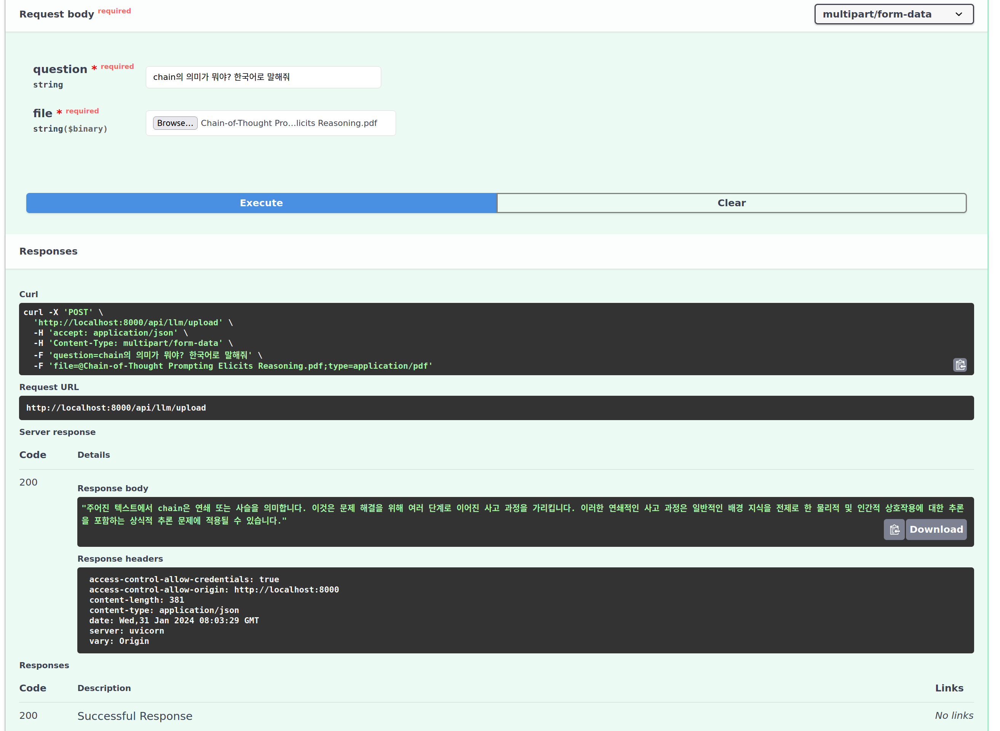

# Documant LangChain Project
LLM(ChatGPT) + ChromaDB + FastApi + MongoDB



## Code Discription
업로드된 파일에서 텍스트를 로드하고, 분할한 다음 OpenAI 임베딩을 사용하여 Chroma 벡터 데이터베이스에 저장하고, 사용자의 질문에 맞는 문서를 검색하여 그 내용을 기반으로 langchain과 OpenAI의 GPT 모델을 사용해 대답을 생성합니다.

FastAPI for Language Model (LLM) Operations
This API provides endpoints for uploading documents, embedding questions, and retrieving answers based on the content of the uploaded documents. It leverages FastAPI for efficient request handling and integrates with MongoDB for storing document vectors and metadata.

## Setup
- .env : OpenAI_API_Key, Mongo_DB_Admin_Name, Mongo_DB_Admin_Password, Mongo_DB_Database_Name  
- python version : Python 3.10
- install Library
```
 pip install -r requirements.txt
```
- server start
```
 python main.py
```