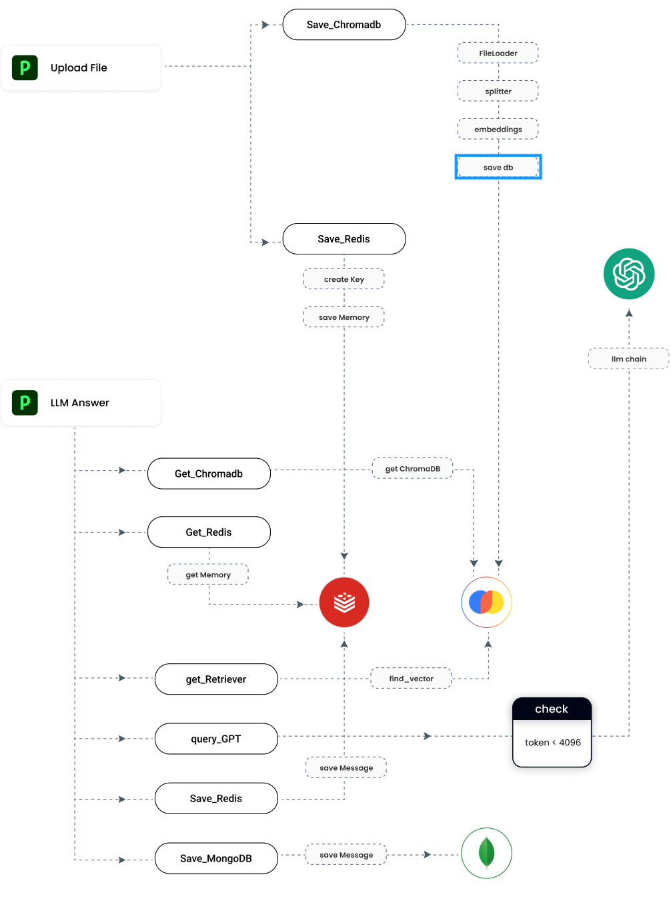
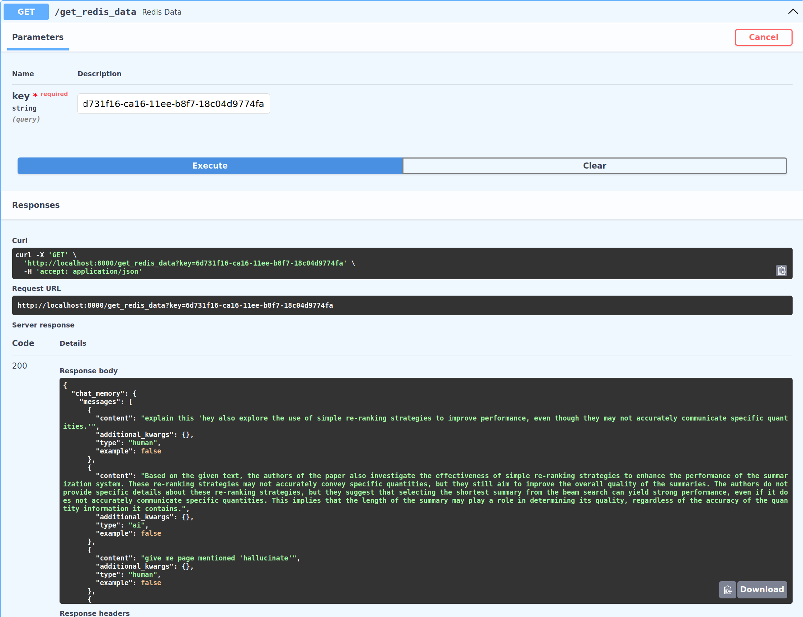

# Documant LangChain Project
LLM(ChatGPT) + React + FastApi + ChromaDB + MongoDB


## Structure
- 파일 업로드 (Upload File)
사용자가 파일을 시스템에 업로드합니다.

- 데이터베이스 저장 (Save_Chromadb)
업로드된 파일은 FileLoader를 통해 처리되며, 파일 내용이 분리(splitter)되어 임베딩(embeddings) 프로세스를 거친 후 데이터베이스에 저장(save db)됩니다.

- Redis 저장 (Save_Redis)
동시에, 데이터는 Redis에도 저장됩니다. 여기서는 키를 생성(createKey)하고 메모리에 데이터를 저장(save Memory)하는 과정을 거칩니다.

- LLM Answer (Language Model Answer)
사용자의 질문에 대한 대답을 생성하기 위해 언어 모델이 사용됩니다.

- 데이터 검색
시스템은 ChromaDB에서 데이터를 검색(Get_Chromadb -> _get ChromaDB)하거나, Redis에서 메모리를 검색(Get_Redis -> _get Memory)할 수 있습니다.

- 검색 엔진 (get_Retriever)
이 단계에서는 find_vector라는 함수를 사용하여 검색 엔진을 통해 필요한 정보를 검색합니다.

- GPT 쿼리 (query_GPT)
검색된 정보를 바탕으로 GPT(Generative Pre-trained Transformer) 모델을 쿼리하여 사용자의 질문에 대한 답변을 생성합니다.

-Redis 저장 (Save_Redis)
생성된 메시지는 다시 Redis에 저장되며, saveMessage 함수를 통해 이루어집니다.

-MongoDB 저장 (Save_MongoDB)
마지막으로, 메시지는 MongoDB에도 저장되며, 이 역시 saveMessage 함수를 사용합니다




## Code Discription
업로드된 파일에서 텍스트를 로드하고, 분할한 다음 OpenAI 임베딩을 사용하여 Chroma 벡터 데이터베이스에 저장하고, 사용자의 질문에 맞는 문서를 검색하여 그 내용을 기반으로 langchain과 OpenAI의 GPT 모델을 사용해 대답을 생성합니다.

FastAPI for Language Model (LLM) Operations
This API provides endpoints for uploading documents, embedding questions, and retrieving answers based on the content of the uploaded documents. It leverages FastAPI for efficient request handling and integrates with MongoDB for storing document vectors and metadata.

## Memory
-ConversationMemory와 redis를 이용한 대화관리



## Setup
- .env : OpenAI_API_Key, Mongo_DB_Admin_Name, Mongo_DB_Admin_Password, Mongo_DB_Database_Name  
- python version : Python 3.10
- install Library
```
 pip install -r requirements.txt
```
- server start
```
 python main.py
```