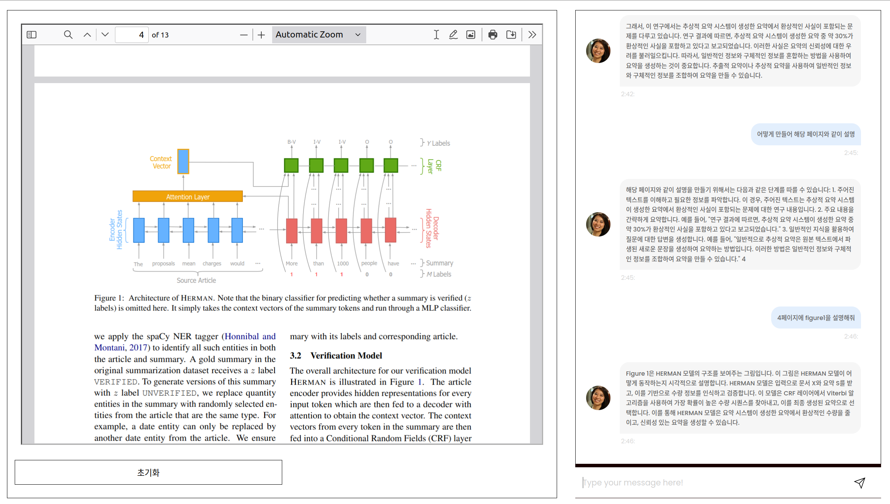
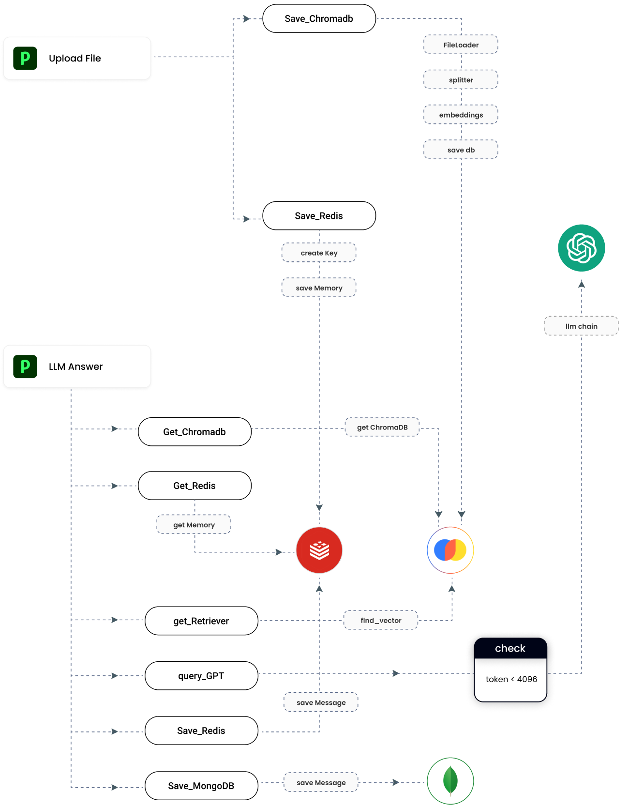

# Documant RAG(Retrieval Augmented Generation) Project
LLM(ChatGPT) + React + FastApi + ChromaDB + Redis + MongoDB



# System Overview

The system facilitates the uploading of files, processes and stores data, utilizes a language model for generating answers, and ensures data persistence across multiple storage solutions.

## Api Structure



## Process Flow

### 1. Upload File
- Users upload files to the system.
- These files are then processed by the `FileLoader`, which is responsible for handling the uploaded content.

### 2. Save to ChromaDB
- Once a file is uploaded, its contents are processed through a series of steps including splitting and embedding.
- The processed data is then saved to ChromaDB, our primary database for storing embedded content.

### 3. Save to Redis
- In parallel to saving data to ChromaDB, the system also stores the data in Redis.
- This involves creating a unique key for each piece of data and saving the data to memory.
- This step ensures fast retrieval of data for future queries.

### 4. Language Model Answer
- To generate answers to user queries, a Language Model (LM) is employed.
- The LM takes user queries and produces relevant answers based on the data available in the system.

### 5. Data Retrieval
- The system can retrieve data from either ChromaDB or Redis.
- This involves searching ChromaDB for specific content or fetching data from Redis memory.

### 6. Search Engine
- A search engine functionality is integrated into the system.
- It uses the `find_vector` function to locate the necessary information within the stored data.

### 7. Query GPT Model
- Based on the information retrieved from the search engine, the system queries the GPT (Generative Pre-trained Transformer) model to generate comprehensive answers to the user's queries.

### 8. Save to Redis Again
- After generating an answer, the message is stored back in Redis.
- This is done using the `saveMessage` function, allowing the system to cache the response for quicker future access.

### 9. Save to MongoDB
- Finally, the generated messages are also saved to MongoDB.
- This step ensures that all interactions and generated content are persistently stored, allowing for data analysis and system improvements over time.


## Environment Variables

To configure your system properly, please set the following environment variables in your `.env` file:

- `OpenAI_API_Key`: Your OpenAI API key for accessing language model services.
- `Mongo_DB_Admin_Name`: Administrator username for MongoDB access.
- `Mongo_DB_Admin_Password`: Password for the MongoDB administrator.
- `Mongo_DB_Database_Name`: The name of the database to use in MongoDB.
- `REDIS_ENDPOINT`: The endpoint URL for the Redis server.
- `REDIS_PORT`: The port on which your Redis server is running.
- `REDIS_PASSWORD`: Password for accessing your Redis server.

## Setting Up `.env`

Create a `.env` file in the root directory of your project and include the following lines:

```plaintext
OpenAI_API_Key=your_openai_api_key_here
Mongo_DB_Admin_Name=your_mongodb_admin_username_here
Mongo_DB_Admin_Password=your_mongodb_admin_password_here
Mongo_DB_Database_Name=your_mongodb_database_name_here
REDIS_ENDPOINT=your_redis_endpoint_here
REDIS_PORT=your_redis_port_here
REDIS_PASSWORD=your_redis_password_here
```

- python version : Python 3.10
- install Library
```
 pip install -r requirements.txt
```
- server start
```
 python main.py
```